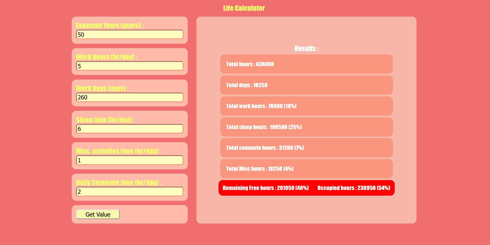

 
##
We have limited time, we spent majority of time doing things either we don't have control over like sleep, or something must have to do, for example boring job.
So have you wondered how much percentage of the life you've actually spent doing things you like vs things you hate?
This small application let's you calculate the amount of time you've spent on job, sleep and other random stuff and how much actual time left on your hand that you can actually utilize to do somehting meaningful. 
##

